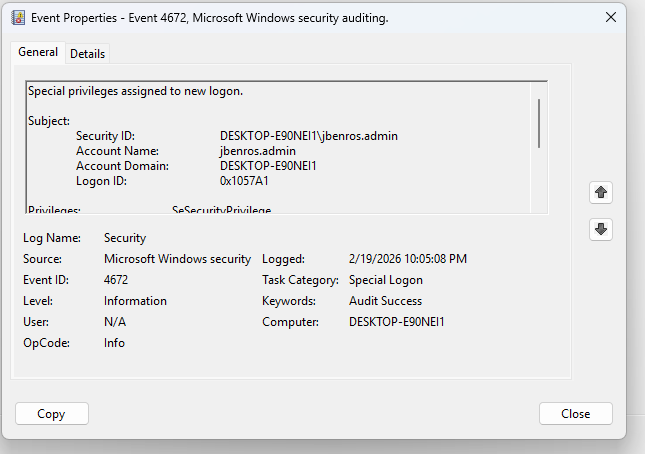

# Phase 1 – Baseline Authentication Behavior

---

## Phase Objective

Establish baseline authentication patterns for:
- Standard user account
- Administrator account

Identify:
- Normal login structure
- Privilege assignment indicators
- Repeating authentication characteristics
- System vs human account noise

---

# Session 1 – 2/18/26

## Objective:

Establish initial baseline for standard user login.

## Standard User Login

## Observed Events:
- Event ID: 4624
- Log Name: Security
- Logon Type: 2 (Interactive)
- Authentication Package: Negotiate

## Privilege Indicators
- No Event ID 4672 observed.
- No elevated privilege assignment detected.

### Analyst Notes
- Normal local login behavior observed.
- No privilege escalation indicators present.

---

## Session 2 – 2/19/26

## Objective
Establish administrator privilege baseline.

## Administrator Login

### Observed Events
- Event ID: 4624
- Event ID: 4672 (Special privileges assigned)
- Logon Type: 2 (Interactive)
- Authentication Package: Negotiate

### Privilege Indicators
- 4672 event confirms elevated privilege assignment at login.
- Not present in standard user baseline.

### Session Context
- Short login session for log review only.

#### Evidence

---

## Session 3 - 2/23/26

## Objective
Confirm stability of standard user baseline.

## Standard User Login

### Observed Events
- Event ID: 4624
- Logon Type: 2 (Interactive)
- Authentication Package: Negotiate
- No 4672 present

### Consistency Analysis
- Login structure matches Session 1 baseline.
- No new privilege markers observed.
- Timestamp pattern consistent with normal usage.

---

# Phase 1 Conclusion

Baseline authentication behavior remains stable across multiple sessions.

Key Findings:
- Standard user logins generate 4624 only.
- Administrator logins generate 4624 + 4672.
- 4672 reliably indicates elevated privilege assignment.
- System accounts (SYSTEM, DWM-#, UMFD-#) appear as background noise and are not human logins.

Phase 1 complete.
